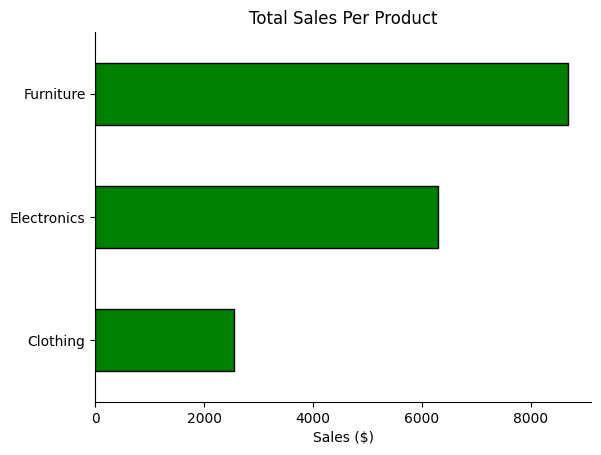
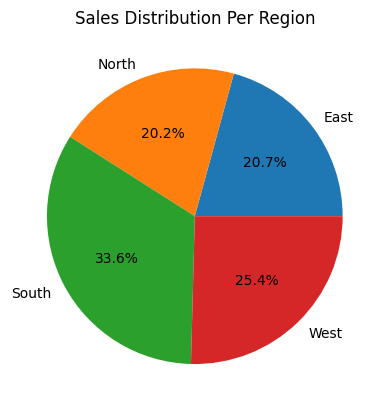
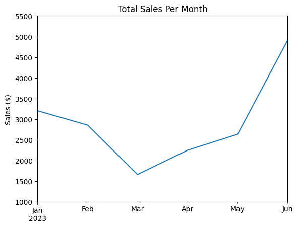

# Overview
Welcome to my basic analysis of a companies sales, products and monthly revenue. I created this project to showcase a beginner level of data analysis and dive into the common questions of a company seeking advice on product sales and future investment insights.

This is a fictional dataset composed of 7 columns showcasing a small companies total sales, unit prices, units sold, products, region, salespersonel, and date throughout a year. Through simple python scripts, I gained knowledge on the total sales by product and region, identification of top-perfomring sales people and insights on future trends.

## Desired Insights
1. Which products generated the highest total sales during the specified period?

2. How do the sales of different regions compare against each other?

3. What insights can be drawn from the sales data to inform future business strategies?

## Tools I Used
 Sticking with the theme of my analysis, I limited my use of complex codes and used only simple features from tools such as:
 + Pandas
 + Matplotlib
 + Seaborn

```python
import pandas as pd

import matplotlib.pyplot as plt

import matplotlib.colors as mcolors

import seaborn as sns
```
# Analysis
 ### 1. Which products generated the highest total sales during the specified period?
I grouped the products by their respective categories, then proceeded to get the sum of the total sales for each category. Showing the product category and total sales in a pivot table before making a visualization from it.
## Visualize
```python
total_sales_per_product = data.groupby('Product')['Total Sale'].sum()
print(total_sales_per_product)

total_sales_per_product.plot(kind='barh', color='Green', edgecolor='black')
plt.title('Total Sales Per Product')
plt.xlabel('Sales ($)')
plt.ylabel('')
sns.despine()
plt.show()
```

## Results

*** Bar chart showing the sales in each category of product**
## Insights
+ Furniture sales are the highest among the group, with over $5000 more than clothing and $2000 more than electronics.

+ Clothing sales are substantially lower than the other 2 categories showing a possible lack of demand in the market.

### 2.How do the sales of different regions compare against each other?
In this section I wanted to dive deeper into the sales and see if there was any region which largely outsold the others or if they were all relitively close, showing trends throughout the entire market rather than one area.
### Visualize
```pyhton
total_sales_per_region = data.groupby('Region')['Total Sale'].sum()

print(total_sales_per_region)

total_sales_per_region.plot(kind='pie', autopct='%1.1f%%')
plt.title('Sales Distribution Per Region')
plt.ylabel('')
plt.show()
```
## Results 

## Insights
+  There wasn't much of a difference in the sales between regions, however it did seem that the southern and western regions outsold the other two by a larger margin.
+ The northern and eastern markets where the most similar in sales distributions with only a .5% difference.
+ The southern market outsold the others by a large difference which (with more time) should be looked into further, as it could help raise sales in the other markets.

### 3. What insights can be drawn from the sales data to inform future business strategies?
For this question I went ahead and separated the date column to be able to pick apart the month. With that in hand I was able to find the sales per month and see how sales fluctuated throughout the year.

### Visualize
```python
data['Date'] = pd.to_datetime(data['Date'])

data['Month'] = data['Date'].dt.to_period('M')

monthly_sales = data.groupby('Month')['Total Sale'].sum()

monthly_sales.plot(kind='line')
plt.ylim(1000, 5500)
plt.title('Total Sales Per Month')
plt.ylabel('Sales ($)')
plt.xlabel('')
plt.show()
```
## Results

## Insights
+ Sales started the year at a high point, however the quickly took a large hit dropping to out lowest point of around $1600 in March.

+ Around May sales started to skyrocket and by June reached a all time high of $5000, ending the first half of the year with nearly double that of the start of the year.

+ The was a low point between Febuary and May where sales seemed to be recuparating from the drop earlier that year.

## Top Sales Personel
This is a simple code used to showcase the top 3 sales people.

```python
top_3_sales_personel = data.groupby('Salesperson')['Total Sale'].sum().sort_values(ascending=False).head(3)

print(top_3_sales_personel)
```
### Result
Salesperson | Total Sale

Bob   :   4506.0

Diana  :  4279.0

Alice  :  3733.5

## Insight
+ Bob, Diana and Alice are responsible for most of the sales in the markets. This could be used for future employee evaluations.

# What I Learned 
- I gained experience in visualizing data using Matplotlib, specifically how to create horizontal bar charts to represent data clearly and effectively. This includes customizing the appearance of charts, such as changing colors, adding outlines, and removing spines for a cleaner presentation.

- I learned how to group and aggregate data using functions like groupby() and sum() in Python’s Pandas library, allowing myself to derive meaningful metrics from raw data.

- The analysis helped me understand how to interpret sales data to derive actionable insights. For example, identifying best-selling products can help inform marketing strategies and inventory decisions.

# Insights
  There is a large market out there for furniture which we should capitalize on. The data shows that the southern market is atributing most of our sales therefore we should dive deeper into why that is to help impliment a plan that allows other regions to have the same success.
  
  We see that out sales decline during the first months of the year therefore we could impliment a plan of action to help decrease the drop. Likewhise we could also lean into the surplus of sales in the later half of the year which could set us up to help decrease that drop.

# Conclusion
This simple analysis not only showcases the sales performance of different products but also serves as a foundation for making informed business decisions, such as identifying products to promote or areas where sales strategies might need adjustment. This also shows the amount of insights you can gain from a small amount of data and how far it could go for a business.


